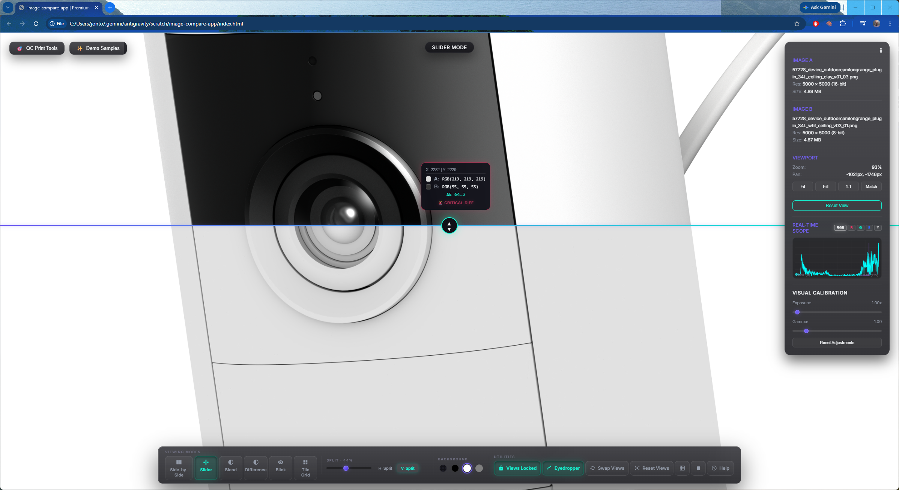
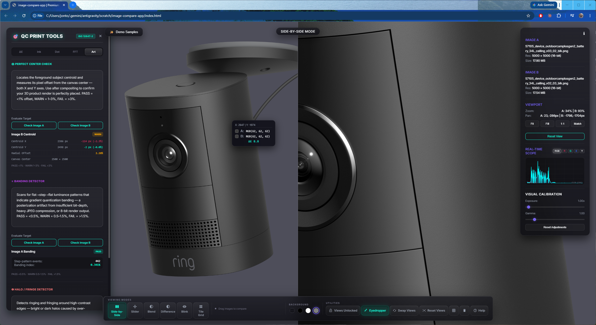
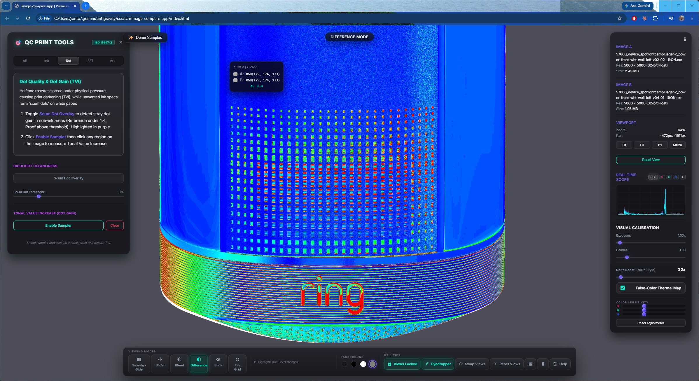

# image-compare-app

A browser-based web application for comparing two high-resolution images side by side, including support for HDR/EXR files. No install required — open it with a local web server and drop in your images.

---

## Screenshots

### Viewport & Scope

*Main workspace in Slider mode. The right-side panel shows a live histogram scope with composite RGB and individual channel curves, along with exposure and gamma controls.*

---

### Print QC Tools

*The Print QC panel open on the Delta-E tab. ROI bounding boxes calculate CIE Lab color deviation between the two images. Also shown: the spectrophotometer pin for measuring CMYK ink percentages and Dot Gain.*

---

### False-Color Thermal Difference Map

*Difference mode with the false-color thermal heatmap enabled. Pixel deviations are boosted and mapped to a blue-to-red spectrum to make subtle differences visible.*

---

## Features

### Comparison Modes
- **Side-by-Side**: Both viewports zoom and pan together, keeping alignment locked.
- **Slider / Curtain**: Drag a horizontal or vertical boundary to reveal Image A or B. The split position is adjustable in the toolbar.
- **Blend**: Cross-fade between Image A and Image B using an opacity slider.
- **Difference**: Subtracts one image from the other. Includes a delta boost slider (up to 256×) and an optional false-color thermal heatmap.
- **Blink / Onion Skin**: Alternates between Image A and B at an adjustable interval. Press <kbd>Space</kbd> to toggle manually.
- **Tile Grid**: Divides the viewport into an alternating mosaic of A/B cells. Tile size is adjustable.

### Histogram Scope
- Live composite RGB and individual channel curves (R, G, B, Luma).
- Updates in real time as you adjust exposure or gamma.
- Displays crush and clip counts at the bottom of the scope.

### Visual Calibration
- **Exposure**: Adjustable from 0.1× to 32×.
- **Gamma**: Adjustable from 0.1 to 6.0.
- Adjustments apply non-destructively via a GPU SVG filter — the source image is unchanged.

### Eyedropper / Pixel Inspector
- Hover over either image to read RGB values at the cursor position for both images simultaneously.
- Shows the per-channel delta (ΔR, ΔG, ΔB) and a composite ΔE estimate.
- Displayed in a floating tooltip that follows the cursor.

### Print QC Suite
- **Delta-E (ΔE)**: Draw ROI bounding boxes to calculate CIE76 Lab color deviation between corresponding regions. Regions are flagged as Pass, Warning, or Fail against ISO tolerance limits.
- **Ink / Total Area Coverage (TAC)**: Highlights pixels where estimated CMYK total ink coverage exceeds a set threshold (adjustable 100–400%). Exceeded pixels are shown as a thermal heatmap overlay.
- **Scum Dot Finder**: Compares highlight areas across both images and marks unexpected ink gain in purple.
- **Dot Gain / TVI Spectrophotometer**: Click any point to place a measurement pin and read estimated CMYK ink percentages and Tonal Value Increase.
- **Moiré / FFT Analyzer**: Draws a 128×128 ROI and runs a 2D Fast Fourier Transform to analyze screen angle and rosette frequency patterns.
- **Artifacts**: Scans for JPEG compression blocks, color banding, and posterization using configurable thresholds.
- All QC overlays and selections are cleared automatically when switching between QC tabs.

### File Support
- Drag and drop, paste (Ctrl+V), or use the file picker to load images.
- Supports PNG, JPEG, WebP, GIF, and HDR/EXR files.
- EXR files are decoded client-side using Three.js EXRLoader with fflate for DWAB/DWAA decompression.
- Sample image pairs are bundled (Blenny comparison, smartwatch 3D renders, VR headset QA renders).

### Viewport Controls
- Pan: click and drag anywhere in the viewport.
- Zoom: scroll wheel.
- Fit / Fill / 1:1 / Match buttons in the side panel.
- Views can be locked (synchronized pan and zoom) or unlocked for independent navigation.
- Background options: checkerboard (for transparency), black, white, or neutral gray.
- Optional center grid alignment overlay.

---

## Getting Started

The app is a single HTML file with local assets. It needs a web server because EXR loading and pixel reads use APIs that browsers block on `file://`. Any local server works:

**Python:**
```bash
python -m http.server 8000
```

**Node.js:**
```bash
npm install -g local-web-server
ws -p 8000
```

Then open `http://localhost:8000` in a browser.

---

## Keyboard Shortcuts

| Key | Action |
|-----|--------|
| <kbd>D</kbd> | Side-by-Side mode |
| <kbd>S</kbd> | Slider mode |
| <kbd>F</kbd> | Blend mode |
| <kbd>G</kbd> | Difference mode |
| <kbd>B</kbd> | Blink mode |
| <kbd>Space</kbd> | Pause blink / toggle frame manually |
| <kbd>T</kbd> | Tile Grid mode |
| <kbd>X</kbd> | Swap Image A and B |
| <kbd>Y</kbd> | Lock / Unlock viewport sync |
| <kbd>I</kbd> | Toggle eyedropper |
| <kbd>R</kbd> | Reset pan and zoom |
| <kbd>L</kbd> | Toggle grid overlay |
| <kbd>C</kbd> | Cycle background |
| <kbd>H</kbd> | Show keyboard shortcuts |
| <kbd>Esc</kbd> | Close open panels |

---

## Technology

- HTML, CSS, vanilla JavaScript — no build step, no framework.
- [Three.js r128](https://threejs.org/) + EXRLoader for client-side EXR decoding.
- [fflate](https://github.com/101arch/fflate) for DWAB/DWAA block decompression.
