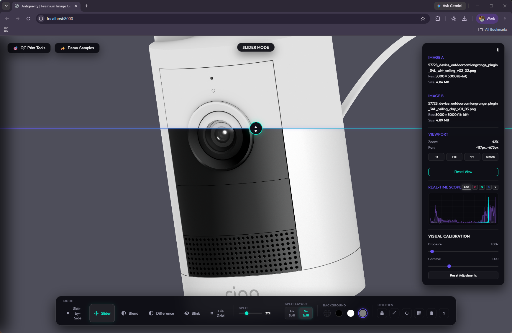
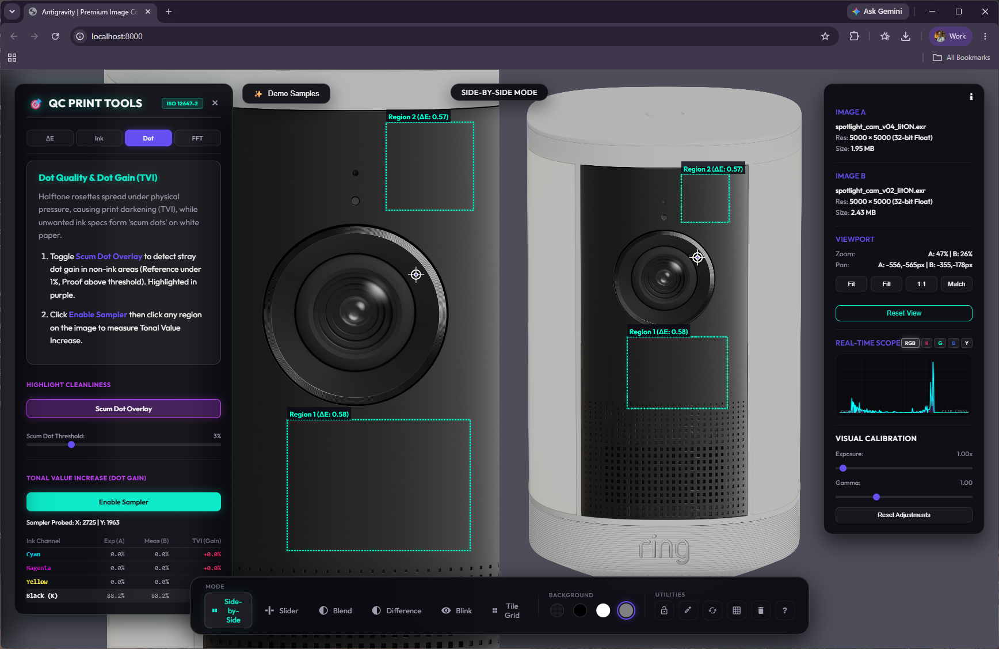
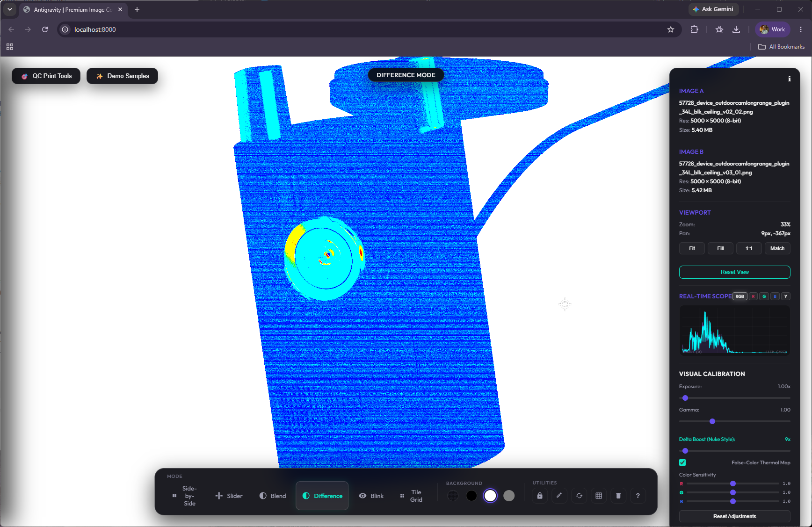

# 🌟 Antigravity | Premium Image Compare & Calibration Suite

Welcome to **Antigravity**, a state-of-the-art, GPU-accelerated single-page web application designed for high-precision image comparison, pre-press Quality Control (QC), and visual calibration. 

Whether you are a 3D artist auditing render passes, a game developer checking texture compression, or a print operator verifying ink coverage and color deviations, Antigravity provides the ultimate suite of real-time analysis tools right in your browser.

---

## 📸 Suggested Screenshot Showcase

To make this repository look incredibly professional on GitHub, here are the **3 best spots** to include screenshots in this ReadMe. 

Once you capture your screen grabs, save them in the `assets/` directory with the matching filenames below, and they will automatically display on your GitHub page!

### Spot 1: The Core Viewport & Split Layout
* **Recommended Filename**: `assets/screenshot_viewer.png`
* **Where to Put It**: Directly below the main title.
* **How to Capture It**:
  1. Load the **Ring Spotlight Cam Plus (EXR)** preset from the Demo Samples menu.
  2. Switch the comparison mode to **Slider** and click **H-Split** (or **V-Split**) in the bottom toolbar.
  3. Drag the slider divider slightly to the side to showcase the split-screen curtain effect.
  4. Make sure the metadata side-panel is open on the right to display the real-time histogram scope.
  5. *Grab a screenshot of the entire browser window!*



---

### Spot 2: Delta-E Color Audit & Probing
* **Recommended Filename**: `assets/screenshot_qc_tools.png`
* **Where to Put It**: Inside the **Print QC Suite** features section.
* **How to Capture It**:
  1. Load the **Luxury Smartwatch Review** preset.
  2. Open **🎯 QC Print Tools** on the left.
  3. Under the **Delta-E ($\Delta E$)** tab, click **Add ROI Region** and draw 2 or 3 bounding boxes over different watch details.
  4. Click the **Dot** tab, click **Enable Sampler**, and click a watch detail to place a target crosshair/pin.
  5. *Capture the left half of the screen showing the beautiful, glassy sidebars and drawn target indicators.*



---

### Spot 3: The False-Color Thermal Difference Heatmap
* **Recommended Filename**: `assets/screenshot_thermal.png`
* **Where to Put It**: Under the **Comparison Modes** section.
* **How to Capture It**:
  1. Load the **VR Headset Optics QA** preset.
  2. Switch comparison mode to **Difference** (press `G`).
  3. Toggle **False-Color Thermal Map** on in the right-side calibration panel.
  4. Drag the **Delta Boost (Nuke Style)** slider to around `16x` or `32x` to illuminate microscopic differences.
  5. *Grab a screenshot of the viewport displaying the gorgeous blue-to-red thermal gradient mapping the optical aberration.*



---

## ✨ Features at a Glance

Antigravity goes far beyond simple side-by-side matching, combining professional prepress mathematics with modern gaming-grade UI aesthetics.

### 🔍 Elite Comparison Modes
* **Synchronized Side-by-Side**: Focus zoom is mapped relative to your mouse pointer, letting you scale both viewports simultaneously and preserve pan alignment offsets down to the pixel.
* **Curtain Slider (Horizontal/Vertical)**: Drag a smooth horizontal or vertical boundary curtain to split and evaluate layouts.
* **Opaque Opacity Blend**: Smoothly cross-dissolve Pane B over Pane A without any transparent background checkered bleed-through.
* **Blink / Onion Skin**: Toggle frame visibility automatically at custom speeds, or tap the <kbd>Spacebar</kbd> to toggle manual frame-by-frame onion skinning.
* **Tile Grid Mosaic**: Split the viewport into an alternating mosaic checkerboard of A/B cells. Drag the slider to scale checkerboard squares down to microscopic sizes.

### 🎨 Visual Calibration HUD
* **Real-time Histogram Scope**: High-frequency composite RGB and individual channel curves (R, G, B, Luma) mapped at 60 FPS using an in-memory downsampled sample grid.
* **Exposure & Gamma Calibration**: Push exposure parameters up to `32.0x` and gamma adjustments up to `6.0` to audit dark areas, clipping thresholds, and raw HDR details.
* **Delta Boost (Nuke Style)**: Boost micro-difference pixel deltas up to `256x` to reveal faint compression blocks and spatial alignments.

### 🎯 Print QC Suite
* **CIE Lab Delta-E ($\Delta E_{ab}$)**: Click and drag to create ROI bounding boxes to calculate color deviation based on human vision (CIE76 standards). Auto-flags warnings and failures based on ISO standard limits.
* **Total Area Coverage (TAC) Heatmap**: Highlight exceeded ink saturation levels (e.g. 300% for offset press publication) in a thermal glowing gradient.
* **Highlight Scum Dot Finder**: Scans pure-white reference highlights for unwanted proof ink gain, highlighting stray dots in bright purple.
* **TVI (Dot Gain) Spectrophotometer**: Click any pixel location to place a target pin and measure subtractive CMYK ink percentages and Dot Gain.
* **Moiré Frequency 2D FFT Analyzer**: Run a Fast Fourier Transform on a selected 128x128 pixel pattern to analyze screen angles and rosette frequencies side-by-side.

---

## 🚀 Getting Started

Antigravity is completely self-contained. Since it runs raw image data queries and HDR parser loads (which require CORS clearance), it is best served through a local development server.

### Option A: Python HTTP Server (Easiest)
If you have Python installed, run this simple command from the project directory:
```bash
python -m http.server 8000
```
Then open [http://localhost:8000](http://localhost:8000) in your web browser!

### Option B: Node.js static server
If you prefer Node:
```bash
npm install -g local-web-server
ws -p 8000
```

---

## ⚡ Keyboard Shortcuts for Power Users

| Key | Action |
| --- | --- |
| <kbd>D</kbd> | Activate Synchronized Side-by-Side Mode |
| <kbd>S</kbd> | Activate Slider (Curtain) Mode |
| <kbd>F</kbd> | Activate Opacity Blend Mode |
| <kbd>G</kbd> | Activate Difference Comparison Mode |
| <kbd>B</kbd> | Activate Blink / Onion Skin Mode |
| <kbd>Space</kbd> | Pause Blink timer & toggle Frame A/B manually |
| <kbd>T</kbd> | Activate Tile Grid Checkerboard Mode |
| <kbd>X</kbd> | Swap Image A and Image B slots |
| <kbd>Y</kbd> | Lock/Unlock Viewport Alignment Sync |
| <kbd>I</kbd> | Toggle RGB Pixel Inspector / Eyedropper |
| <kbd>R</kbd> | Reset Pan & Zoom back to 1:1 original scale |
| <kbd>L</kbd> | Toggle Center Grid Alignment lines |
| <kbd>C</kbd> | Cycle backgrounds (Checkered → Black → White → Gray) |
| <kbd>Esc</kbd> | Collapse active sidebars and panels |

---

## 🛠️ Technology Stack
* **Structure**: HTML5 (Clean semantic structure)
* **Styling**: Modern, premium dark-mode CSS with glassmorphic HUD panels and hardware-accelerated animations.
* **Engine**: Vanilla ES6 JavaScript (Performance-optimized pixel-buffer analysis).
* **Decoders & Parsers**:
  * [Three.js r128](https://threejs.org/) & `EXRLoader` for client-side float rendering.
  * [fflate](https://github.com/101arch/fflate) for blazing-fast DWAB/DWAA block decompression in EXR files.
